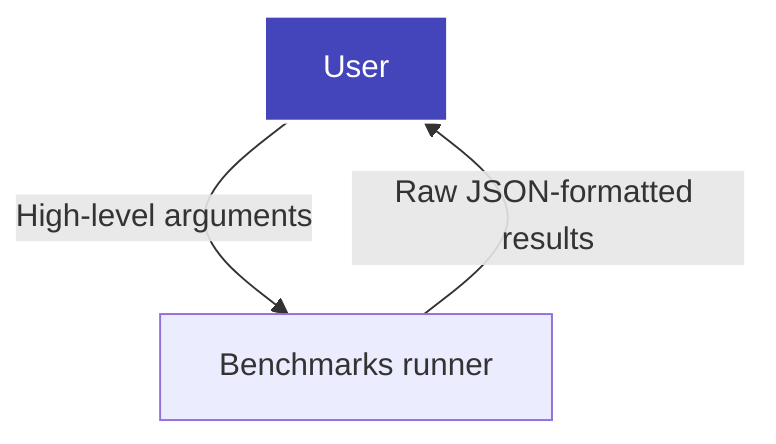

# Machine Learning Benchmarks

[](https://dev.azure.com/daal/scikit-learn_bench/_build/latest?definitionId=8&branchName=main)

**Scikit-learn_bench** is a benchmark tool for libraries and frameworks implementing Scikit-learn-like APIs and other workloads.

Benefits:
- Full control of benchmarks suite through Python config scripts
- Flexible benchmark case generation with ordinary Python
- Available with advanced profiling tools, such as Intel(R) VTune* Profiler

### 📜 Table of Contents

- [Machine Learning Benchmarks](#machine-learning-benchmarks)
  - [🔧 Create a Python Environment](#-create-a-python-environment)
  - [🚀 How To Use Scikit-learn\_bench](#-how-to-use-scikit-learn_bench)
    - [Benchmarks Runner](#benchmarks-runner)
    - [Python Configs](#python-configs)
    - [Scikit-learn\_bench High-Level Workflow](#scikit-learn_bench-high-level-workflow)
  - [📑 Documentation](#-documentation)

## 🔧 Create a Python Environment

How to create a usable Python environment with the following required frameworks:

- **sklearn, sklearnex, and gradient boosting frameworks**:

```bash
# with pip
pip install -r envs/requirements-sklearn.txt
# or with conda
conda env create -n sklearn -f envs/conda-env-sklearn.yml
```

- **RAPIDS**:

```bash
conda env create -n rapids --solver=libmamba -f envs/conda-env-rapids.yml
```

## 🚀 How To Use Scikit-learn_bench

### Benchmarks Runner

How to run benchmarks using the `sklbench` module and a specific configuration:

```bash
python -m sklbench --config path/to/config.py
```

The default output is an append-only `results/` directory containing flat,
timestamped benchmark result files and hash-named environment sidecars. To
specify a custom output directory, run:

```bash
python -m sklbench --config path/to/config.py --results-dir results_example
```

For a description of all benchmarks runner arguments, refer to [documentation](sklbench/runner/README.md#arguments).

### Python Configs

Benchmark configs are trusted Python scripts. The orchestrator imports the
script passed to `--config`, calls `generate_cases()`, validates each returned
case with `sklbench.config.validate_case`, and passes normalized dictionaries to
the runner.

`generate_cases()` must return a `list[dict]`:

```python
def generate_cases():
    return [
        {
            "bench": {"n_runs": 3},
            "implementation": {"library": "sklearn"},
            "algorithm": {
                "estimator": "RandomForestClassifier",
                "estimator_params": {"n_estimators": 16, "random_state": 42},
            },
            "data": {
                "source": "make_classification",
                "generation_kwargs": {
                    "n_samples": 1000,
                    "n_features": 10,
                    "n_informative": 5,
                },
                "split_kwargs": {"test_size": 0.2},
            },
        }
    ]
```

Config scripts are ordinary Python, so use imports, helper functions, and
`itertools.product` directly for computed cases. For manual validation:

```bash
python - <<'PY'
from sklbench.config import load_cases_from_script

cases = load_cases_from_script("path/to/config.py")
print(len(cases))
PY
```

For the accepted case format, see the Pydantic models in
[`sklbench/config/models.py`](sklbench/config/models.py).

### Scikit-learn_bench High-Level Workflow



The runner currently executes sklearn-like estimator cases: load or generate
data, preprocess and split it, instantiate the estimator, fit, predict, and
record timings and metrics.

## 📑 Documentation
[Scikit-learn_bench](README.md):
- [Benchmarks Runner](sklbench/runner/README.md)
- [Reports](sklbench/reports/README.md)
- [Data Processing and Storage](sklbench/datasets/README.md)
- [Emulators](sklbench/emulators/README.md)
- [Developer Guide](docs/README.md)
