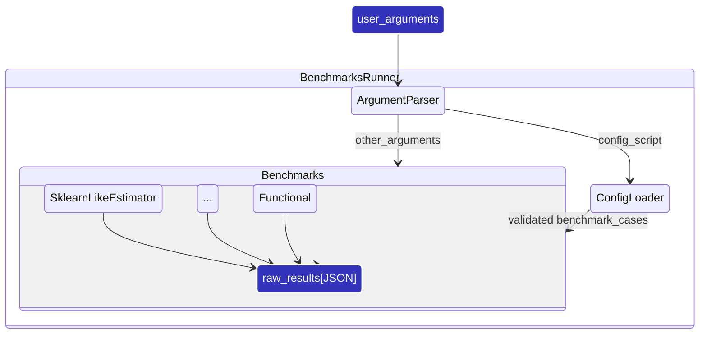

# Developer Guide

This document covers topics useful for contributors to Scikit-learn_bench:

- [Developer Guide](#developer-guide)
  - [High-level workflow of Scikit-learn\_bench](#high-level-workflow-of-scikit-learn_bench)
  - [Python config workflow](#python-config-workflow)

## High-Level Workflow of Scikit-learn_bench

Scikit-learn_bench consists of three main parts:
 - **Benchmarks runner**:
     1. Consumes user-provided high-level arguments (argument parser).
     2. Loads a Python config script and validates generated benchmark cases.
     3. Combines the raw outputs.
 - **Individual benchmarks** wrapping specific entities or workloads (sklearn-like estimators, custom functions, etc.)

Runner is responsible for orchestration of benchmarking cases, individual benchmarks - for actual run of each case.

## Python config workflow

Benchmark configuration is ordinary Python. A config script exposes a
`generate_cases()` function returning a list of case dictionaries.

Config loading steps:

1. Import the script passed to `--config`.
2. Call `generate_cases()`.
3. Validate every returned dict with `sklbench.config.validate_case`.
4. Pass normalized JSON-serializable cases to the runner.

Computed values, combinations, imports, and filtering should be expressed
directly in Python inside the config script.

---
[Documentation tree](../README.md#-documentation)
